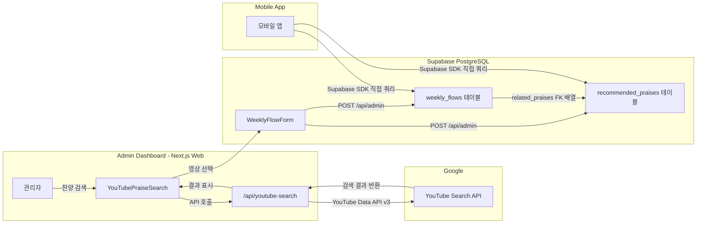

# YouTube API 서비스 아키텍처 문서 작성

## 배경

CCC 커뮤니티앱의 찬양 추천 서비스는 관리자가 YouTube에서 찬양 영상을 검색하여 DB에 저장하고, 모바일 앱 사용자가 해당 데이터를 조회하는 구조이다. 이 서비스 흐름을 설명하는 내부 문서를 작성한다.

## 전체 데이터 흐름

## 작성할 문서 파일

[docs/youtube-api-service.md](docs/youtube-api-service.md) (신규 생성)

## 문서 구성

### 1. 서비스 개요

- 서비스명: CCC 커뮤니티앱 - 찬양 추천 서비스
- 목적: 매주 교회 예배에 맞는 추천 찬양을 관리자가 큐레이션하여 모바일 앱 사용자에게 제공
- 사용하는 YouTube API: **YouTube Data API v3 - Search endpoint**

### 2. YouTube API 사용 상세

- 사용 엔드포인트: `GET https://www.googleapis.com/youtube/v3/search`
- 요청 파라미터: `part=snippet`, `type=video`, `maxResults=5`, `q=검색어`, `pageToken=페이징`
- 응답에서 추출하는 데이터: `videoId`, `title`, `channelTitle`, `thumbnails.medium.url`
- API 키 관리: 서버 사이드 전용 (환경변수 `NEXT_PUBLIC_YOUTUBE_API_KEY`)
- 호출 주체: Next.js API Route ([app/api/youtube-search/route.ts](app/api/youtube-search/route.ts))에서만 호출, 클라이언트에서 직접 호출하지 않음

### 3. 데이터 저장 구조

- `recommended_praises` 테이블 스키마 설명:
  - `title`: 영상 제목
  - `external_url`: YouTube 영상 링크 (`https://www.youtube.com/watch?v={videoId}`)
  - `thumbnail_url`: 썸네일 이미지 URL
  - `platform`: `"youtube"` (enum)
  - `description`: 채널명
  - `is_playlist`: `false`
- `weekly_flows` 테이블의 `related_praises` 컬럼: `recommended_praises`의 ID 배열로 연결

### 4. 접근 제어 및 보안

- YouTube 검색은 관리자만 사용 가능 (Supabase Auth + `is_admin` 플래그 기반)
- DB 쓰기는 `/api/admin` 라우트를 통해 Service Role Key로 RLS 우회
- API 키는 서버 환경변수에 저장, 클라이언트 노출 없음

### 5. 모바일 앱 연동 흐름

- 모바일 앱은 Supabase SDK를 통해 `recommended_praises`, `weekly_flows` 테이블 직접 조회
- `weekly_flows.related_praises` (ID 배열)를 기반으로 `recommended_praises` JOIN 쿼리
- `active_from` / `active_until` 날짜 범위 기반으로 현재 활성 주간 흐름 필터링
- 모바일 앱에서는 YouTube API 직접 호출 없음 (DB에 캐싱된 메타데이터만 사용)

### 6. API 할당량 및 비용

- YouTube Data API v3 무료 할당량: 일 10,000 유닛
- Search 요청당 100 유닛 소모
- 일 최대 약 100회 검색 가능
- 관리자 전용이므로 할당량 초과 가능성 낮음

### 7. YouTube Terms of Service 준수 사항

- YouTube 로고/브랜드 가이드라인 준수
- 영상 링크를 통한 YouTube 사이트/앱으로의 리디렉션 (임베드 아님)
- 사용자 데이터 수집하지 않음
- API 데이터 캐싱 정책 (30일 규칙) 관련 참고 사항