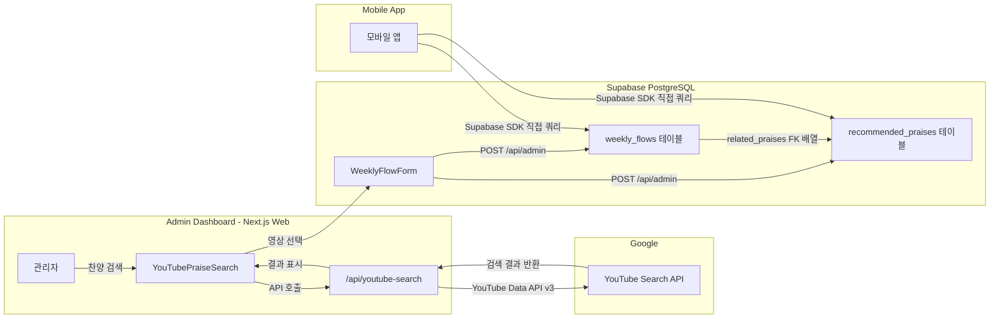

# YouTube API 서비스 아키텍처 문서

CCC 커뮤니티앱 - 찬양 추천 서비스의 YouTube Data API 사용 방식 및 전체 데이터 흐름을 설명하는 내부 문서입니다.

---

## 1. 서비스 개요

| 항목 | 내용 |
|------|------|
| **서비스명** | CCC 커뮤니티앱 - 찬양 추천 서비스 |
| **목적** | 매주 교회 예배에 맞는 추천 찬양을 관리자가 큐레이션하여 모바일 앱 사용자에게 제공 |
| **사용 API** | YouTube Data API v3 - Search endpoint |

관리자는 관리자 대시보드에서 YouTube를 통해 찬양 영상을 검색하고, 선택한 영상의 메타데이터(제목, 링크, 썸네일 등)를 DB에 저장합니다. 모바일 앱 사용자는 DB에 저장된 추천 찬양 목록을 조회하여 해당 주의 예배 찬양을 확인합니다.

---

## 2. 전체 데이터 흐름

---

## 3. YouTube API 사용 상세

### 3.1 엔드포인트

| 항목 | 값 |
|------|-----|
| **URL** | `GET https://www.googleapis.com/youtube/v3/search` |
| **인증** | API Key (서버 사이드 환경변수) |

### 3.2 요청 파라미터

| 파라미터 | 설명 | 예시 |
|----------|------|------|
| `part` | 반환할 리소스 파트 | `snippet` |
| `type` | 검색 대상 유형 | `video` |
| `maxResults` | 페이지당 결과 수 | `5` |
| `q` | 검색어 | URL 인코딩된 문자열 |
| `pageToken` | 다음 페이지 토큰 (페이징) | `CAoQAA` (선택) |

### 3.3 응답에서 추출하는 데이터

| 필드 | YouTube API 경로 | DB 저장 컬럼 |
|------|------------------|--------------|
| 영상 ID | `items[].id.videoId` | `external_url` (URL 조합) |
| 제목 | `items[].snippet.title` | `title` |
| 채널명 | `items[].snippet.channelTitle` | `description` |
| 썸네일 | `items[].snippet.thumbnails.medium.url` | `thumbnail_url` |

### 3.4 API 키 관리

- **환경변수**: `NEXT_PUBLIC_YOUTUBE_API_KEY`
- **호출 위치**: Next.js API Route (`app/api/youtube-search/route.ts`)에서만 호출
- **클라이언트 노출**: 클라이언트에서 YouTube API를 직접 호출하지 않음. 모든 요청은 `/api/youtube-search`를 통해 서버에서 프록시됨.

---

## 4. 데이터 저장 구조

### 4.1 recommended_praises 테이블

YouTube 검색 결과 중 관리자가 선택한 영상이 이 테이블에 저장됩니다.

| 컬럼 | 타입 | 설명 |
|------|------|------|
| `id` | number | PK (자동 생성) |
| `title` | string | 영상 제목 |
| `description` | string \| null | 채널명 |
| `external_url` | string | YouTube 영상 링크 (`https://www.youtube.com/watch?v={videoId}`) |
| `thumbnail_url` | string \| null | 썸네일 이미지 URL |
| `platform` | enum | `"youtube"` |
| `is_playlist` | boolean | `false` (단일 영상) |
| `order_index` | number \| null | 정렬 순서 |
| `created_at` | timestamp | 생성 시각 |

### 4.2 weekly_flows 테이블

주간 흐름(프로그램) 정보와 추천 찬양의 연결 관계를 저장합니다.

| 컬럼 | 타입 | 설명 |
|------|------|------|
| `id` | number | PK |
| `title` | string | 주간 흐름 제목 |
| `description` | string | 설명 |
| `sub_description` | string \| null | 부가 설명 |
| `active_from` | date \| null | 게시 시작일 |
| `active_until` | date \| null | 게시 종료일 |
| `related_praises` | number[] \| null | `recommended_praises.id` 배열 (FK) |
| `related_events` | number[] \| null | 관련 이벤트 ID 배열 |
| `related_notices` | number[] \| null | 관련 공지 ID 배열 |

`related_praises`는 `recommended_praises` 테이블의 ID 배열로, 해당 주간에 추천되는 찬양 목록을 참조합니다.

---

## 5. 접근 제어 및 보안

| 구분 | 내용 |
|------|------|
| **YouTube 검색** | 관리자만 사용 가능. Supabase Auth + `user_info.is_admin` 플래그 기반 |
| **DB 쓰기** | `/api/admin` 라우트를 통해 Service Role Key로 RLS 우회. 관리자 인증 필수 |
| **API 키** | 서버 환경변수에 저장. 클라이언트에 노출되지 않음 |
| **라우트 보호** | `middleware.ts`에서 `/admin-dashboard` 접근 시 미인증 사용자 로그인 페이지로 리다이렉트 |

---

## 6. 모바일 앱 연동 흐름

모바일 앱은 YouTube API를 직접 호출하지 않습니다. Supabase SDK를 통해 DB에 저장된 데이터만 조회합니다.

### 6.1 데이터 조회 방식

1. **weekly_flows 조회**: `active_from` ≤ 현재 날짜 ≤ `active_until` 조건으로 현재 활성 주간 흐름 필터링
2. **related_praises 연결**: `weekly_flows.related_praises` (ID 배열)를 기반으로 `recommended_praises` 테이블 JOIN
3. **영상 재생**: `recommended_praises.external_url` (YouTube 링크)를 통해 YouTube 앱/웹으로 리디렉션

### 6.2 모바일 앱에서 사용하는 데이터

- `weekly_flows`: 제목, 설명, 게시 기간, 관련 찬양 ID 목록
- `recommended_praises`: 제목, YouTube 링크, 썸네일 URL

모바일 앱은 DB에 캐싱된 메타데이터만 사용하며, YouTube API 할당량을 소비하지 않습니다.

---

## 7. API 할당량 및 비용

| 항목 | 값 |
|------|-----|
| **YouTube Data API v3 무료 할당량** | 일 10,000 유닛 |
| **Search 요청당 소모** | 100 유닛 |
| **일 최대 검색 횟수** | 약 100회 |
| **실제 사용량** | 관리자 전용 검색이므로 할당량 초과 가능성 낮음 |

---

## 8. YouTube Terms of Service 준수 사항

| 항목 | 준수 내용 |
|------|-----------|
| **브랜드** | YouTube 로고/브랜드 가이드라인 준수 |
| **영상 표시** | 영상 링크를 통한 YouTube 사이트/앱으로의 리디렉션 (임베드 아님) |
| **사용자 데이터** | YouTube API를 통해 사용자 개인 데이터 수집하지 않음 |
| **캐싱** | API 데이터를 DB에 저장. YouTube API 서비스 약관의 캐싱 정책(30일 규칙 등) 참고 필요 |

---

## 9. 관련 파일

| 파일 | 역할 |
|------|------|
| `app/api/youtube-search/route.ts` | YouTube Search API 프록시 (서버 사이드 호출) |
| `app/components/admin-dashboard/YouTubePraiseSearch.tsx` | 검색 UI, 무한 스크롤 페이징 |
| `app/components/admin-dashboard/WeeklyFlowForm.tsx` | 주간 흐름 생성/수정 폼, 찬양 선택 및 DB 저장 |
| `app/api/admin/route.ts` | 관리자 CRUD API (recommended_praises, weekly_flows 등) |
